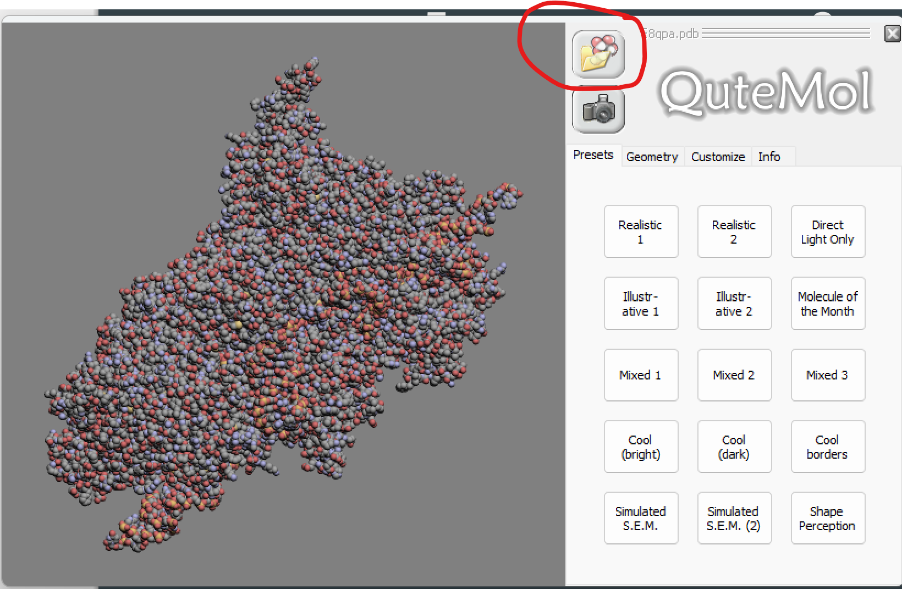
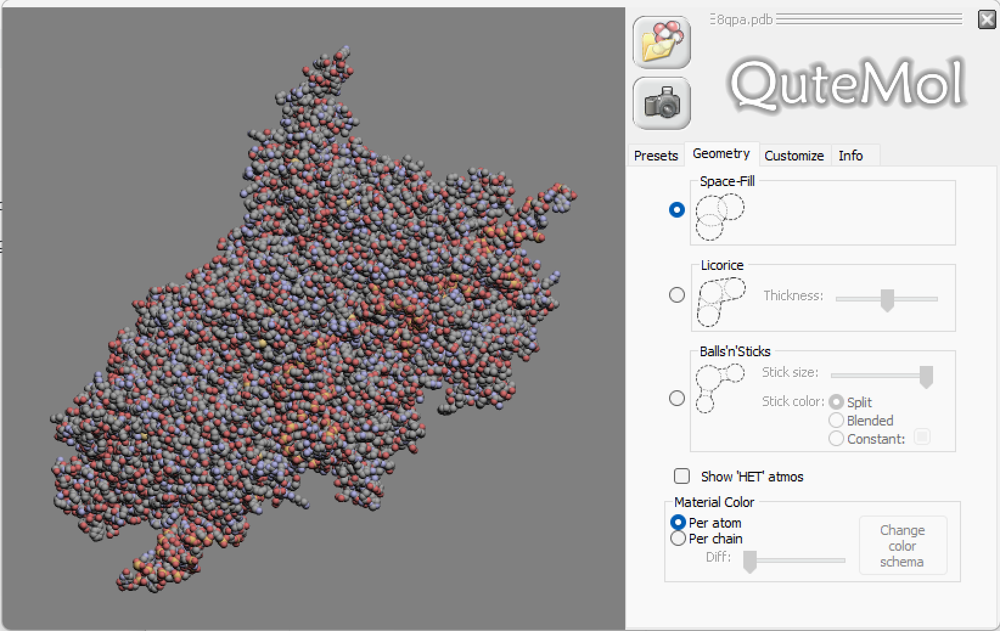
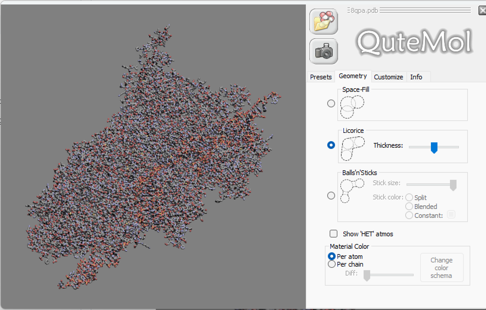
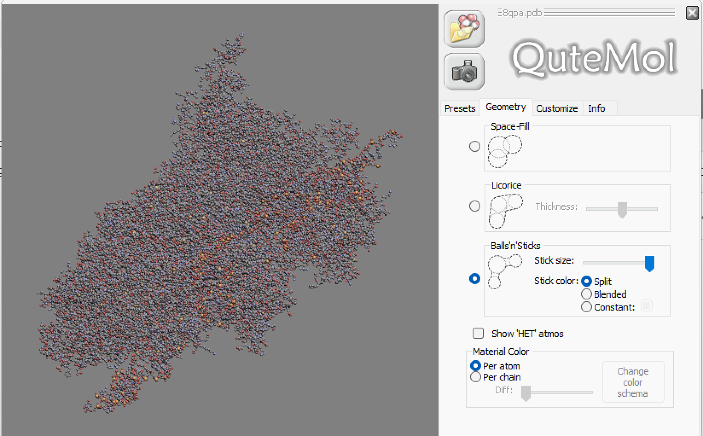
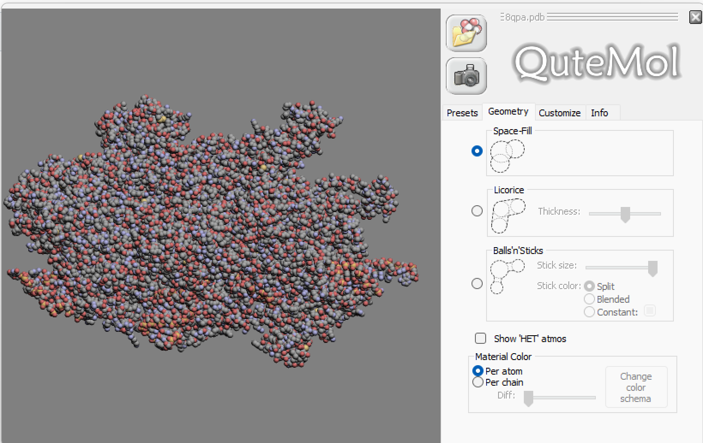
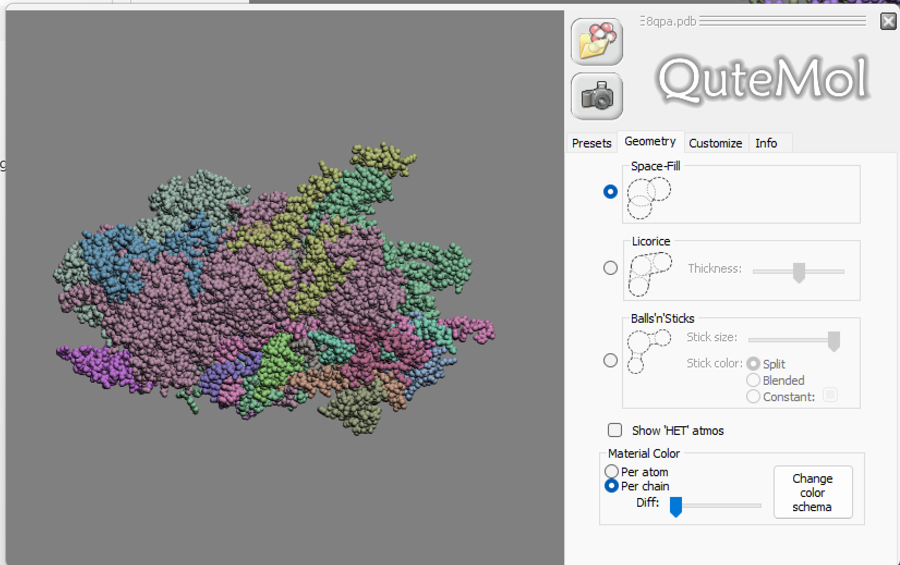

## Программное обесчечение QuteMol
## Белок 8QPA

## Загрузка

1) Запускае приложение
2) Добавляем белок

## Визуализация

Необходимо перейти во вкладку "Geometry" и 
выбрать один из 3-х режимов (Space-Fill по-умолчанию)

1) Space-Fill

2) Licorice (Wireframe)

3) Balls'n'Sticks

## Раскраска структуры

Также во вкладке "Geometry" снизу, в блоке Material Color
выбрать один из режимов

1) Per atom (CPK)

2) Per Chain (по доменам белка)

## Изображение публикационного качества

Необходимо выбрать один из пресетов во вкладке "Presets"
или настроить самому

Я выбрал пресет "Illustrative 1"

