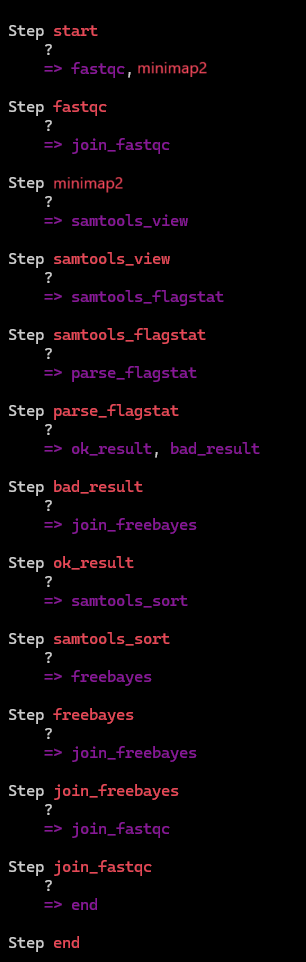
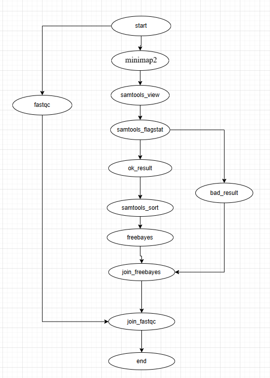

## Ссылка на NCBI
https://trace.ncbi.nlm.nih.gov/Traces/?view=run_browser&acc=SRR31200022&display=metadata

## Скрипт
смотреть script.sh

## Резульатат samtools flagstat
смотреть samtools_flagstat.txt

## Инструкция
Установите python3, pip и python-venv  
Создайте venv: python3 -m venv venv  
Активируйте: source venv/bin/activate  
Установите Metaflow: pip install metaflow  
Запустите hello_world.py:  python hello_world.py run  

## Пайплайн “оценка качества картирования”
смотреть pipeline/pipeline.py

### Запуск: python pipeline.py run --ref_file ecoli.fna --seq_file ecoli.fastq
### Визуализация: python pipeline.py show

### Схема

### Сравнение
На схеме наглядно видно стадии которые выполняются параллельно с основным процессом,   
из за использования параллельных вычислений в схему добалвяются join_* шаги   
в местах где процессы должны слиться в одну линию исполнения.