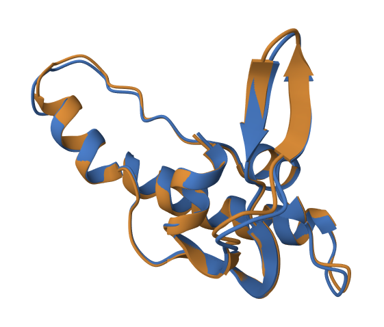

## Последовательность
MVEYFGQNLNGFLFTKNAWVQSYGTRCVKPPIVWGDVSRANPITVEWSAYAQSKTDHVMKGMLTGPVTILNWSWPREDITHEEQTKQLALAIRDEVLDLE

## Инструмены фолдинга белков

RoseTTAFold2  
AlphaFold2

## Инструмент парного выравнивания

jFATCAT-rigid (в списке Alignment Method)

## Ноутбуки см. папка notebooks

## Предсказания см. папка predictions

## Парное выравнивание см. папка alignment

## Визуализация парного выравнивания
### Инструмент https://www.rcsb.org/3d-view/

## Вывод
Полученные предсказания совпадают на 100%.
