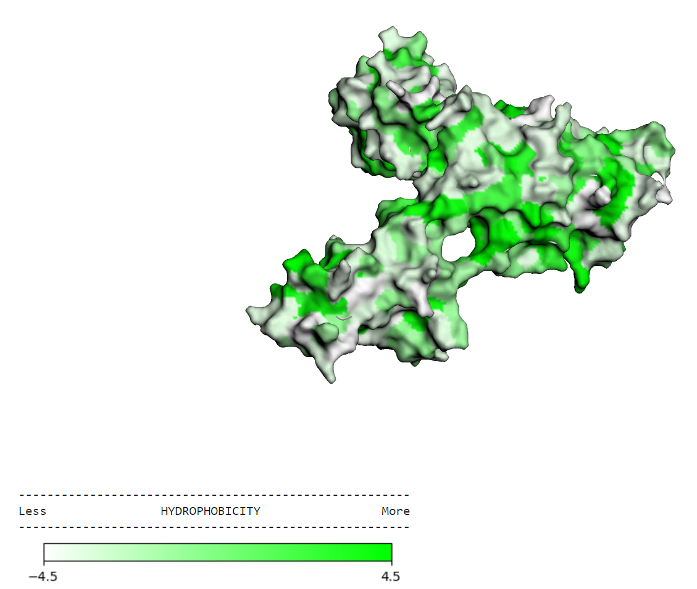
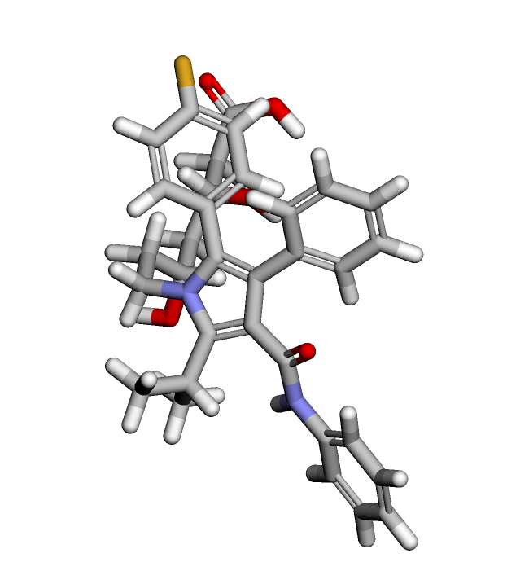
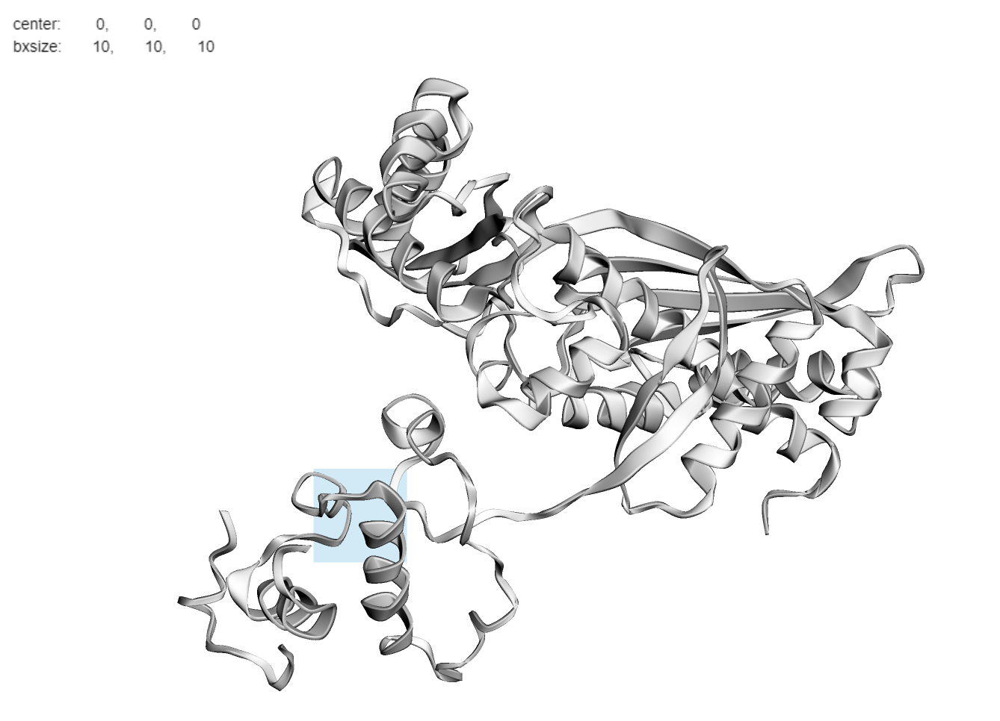
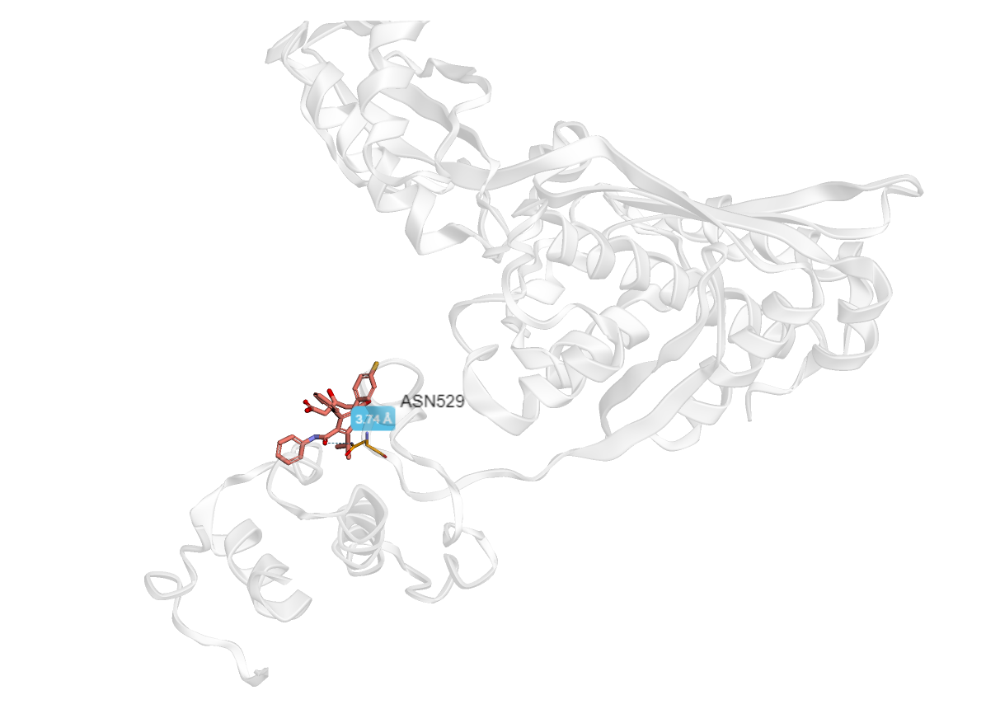

## Инормация о препарате
Название: Аторвастатин   
Действующее вещество: Аторвастатин  
### Область применения:
 - Снижение повышенного общего холестерина  
 - Профилактика сердечно-сосудистых осложнений у пациентов
### Молекулярный механизм действия  
Снижает уровни холестерина и липопротеинов в плазме за счёт угнетения ГМГ-КоА-редуктазы, синтеза холестерина в печени и увеличения числа «печёночных» рецепторов ЛПНП на поверхности клеток, что приводит к усилению захвата и катаболизма ЛПНП.  
ЛПНП - липопротеины низкой плотности

## Ноутбук с докингом
[docking.ipynb](docking.ipynb)
## Трехмерная структура подготовленного таргета

## Трехмерная структура исходного лиганда

## Бокс

## Докинг

